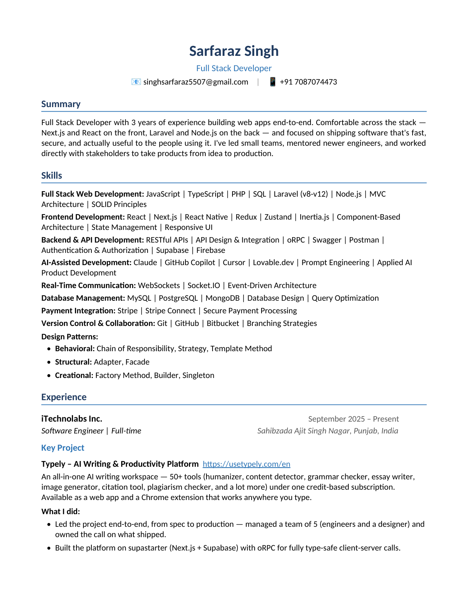
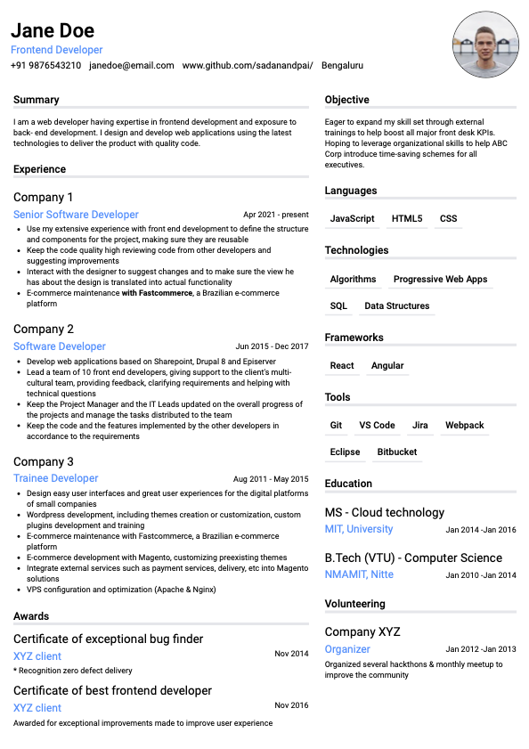
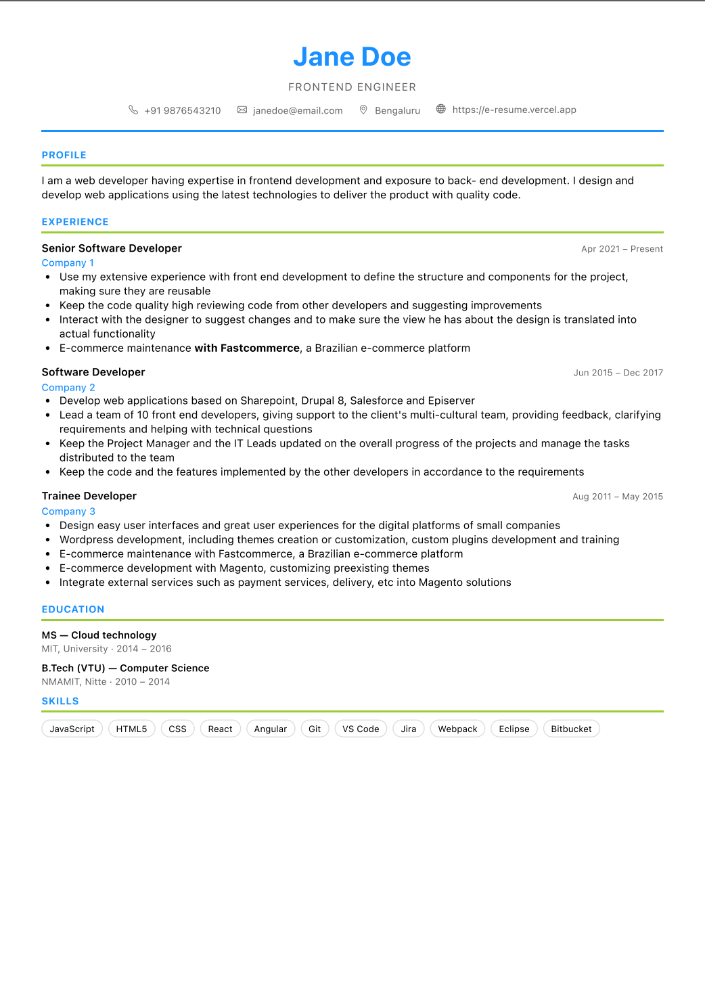

<div align="center">

# ResumeForge

**A free, no-BS resume builder. Pick a template, fill in your details, download a polished PDF.**

No account. No paywall. No watermark. Your data never leaves your browser.

[**Live app →**](https://resumebuilder-3ka.pages.dev/)


</div>

---

## Why this exists

Most resume builders let you do the work, then ask for a subscription at the download button. ResumeForge doesn't. Everything runs client-side: you edit, you see a live preview, you hit **Download as PDF**, and you're done.

Because there is no backend, there is also no database of your resume. Your content is stored in your own browser's `localStorage` and nowhere else.

## Features

- **Four resume templates** — Professional, Modern, Minimal, and Classic, each a real React component rather than a theme toggle.
- **Live preview** — the pane on the left is the document you download. Edits show up as you type.
- **Rich text where it matters** — experience and project descriptions use a TipTap editor, so bullet lists and emphasis survive into the PDF.
- **Print-perfect PDF export** — `react-to-print` with A4 page rules and print-specific overrides, so the export isn't a screenshot of a webpage.
- **Autosave by default** — every section persists to `localStorage`. Close the tab, come back, your resume is still there.
- **Reset without fear** — one button restores every section to the seed content, with a confirmation step.
- **Template-driven forms** — each template declares which sections and fields it supports; the builder sidebar renders itself from that declaration.
- **Zero sign-up, zero tracking, zero server.**

## Templates

| Professional | Modern |
|---|---|
|  |  |
| **Minimal** | **Classic** |
|  |  |

## Tech stack

| Layer | Choice |
|---|---|
| UI | React 19 + React Router 7 |
| Build | Vite 8 |
| Styling | Tailwind CSS 4 (via `@tailwindcss/vite`) |
| State | Zustand 5 with `persist` middleware |
| Rich text | TipTap 3 |
| PDF | `react-to-print` |
| Dialogs | SweetAlert2 |
| Icons | lucide-react + MUI Icons |
| Hosting | Cloudflare Pages (Wrangler) |

## Getting started

**Requirements:** Node.js 24 (see [.nvmrc](.nvmrc)) and npm.

```bash
git clone https://github.com/sarfaraz1212/ResumeBuilder.git
cd ResumeBuilder
npm install
npm run dev
```

The dev server starts at `http://127.0.0.1:5173`.

### Scripts

| Command | What it does |
|---|---|
| `npm run dev` | Start the Vite dev server with HMR |
| `npm run build` | Production build into `dist/` |
| `npm run preview` | Serve the production build locally |
| `npm run lint` | Run ESLint across the project |
| `npm run cf:preview` | Build, then serve through Cloudflare Pages locally |
| `npm run deploy` | Build and deploy to Cloudflare Pages |

## Project structure

```
src/
├── main.jsx                     # Router setup: / and /builder
├── pages/
│   ├── Home.jsx                 # Landing page + template gallery
│   └── Builder.jsx              # Split view: preview | editor, PDF + reset actions
├── assets/templates/            # Template blueprints (metadata + section schema)
│   ├── templates.js             # Registry — the array the app reads
│   ├── professional.js
│   ├── modern.js
│   ├── minimal.js
│   └── classic.js
├── componenets/
│   ├── builder/
│   │   ├── BuilderOptions.jsx   # Renders sidebar forms from the blueprint
│   │   └── templateRenderer.jsx # Renders the selected template component
│   ├── builderOptions/          # One form per section (About, Skills, …)
│   ├── form/                    # Input, Textarea, Accordion, Modal, RichTextEditor
│   └── templates/               # The actual resume layouts
│       ├── professional/        # Split into Header, Skills, Experience, …
│       ├── modern/
│       ├── minimal/
│       └── classic/
└── stores/                      # One Zustand store per resume section
    ├── about.js  skills.js  experience.js  projects.js  education.js
    ├── awards.js  languages.js  references.js  volunteer.js
    ├── template.js              # Which template is selected
    └── resetAll.js              # Resets every section store at once
```

> **Note:** `src/componenets/` is misspelled in the codebase. It's load-bearing across every import, so it stays as-is until someone does a clean rename. PRs welcome.

## How it works

### Blueprints drive the UI

A template isn't just a component — it's a blueprint object that declares what the template can display:

```js
// src/assets/templates/professional.js
const BLUEPRINT = {
  id: "PROFESSIONAL",
  name: "professional",
  description: "A clean single-column professional resume.",
  component: Professional,   // the React component that renders it
  thumbnail,                 // gallery image
  favourite: true,
  sections: {
    about: {
      allowedFields: [
        { name: "name",  type: "text" },
        { name: "email", type: "email" },
        // …
      ],
    },
    experience: {
      allowedFields: [
        { name: "company",     label: "Company",     type: "text" },
        { name: "description", label: "Description", type: "editor" },
        // …
      ],
    },
    // skills, projects, education, certifications…
  },
};
```

`BuilderOptions` reads `sections` and renders only the forms that template supports. Pick a template with no `certifications` section and the Certifications accordion simply doesn't appear. Field `type` selects the control: `editor` gives you TipTap, everything else maps to a standard input.

### State lives in per-section stores

Each resume section is its own persisted Zustand store, keyed as `rb-<section>` in `localStorage`:

```js
const useExperienceStore = create(
  persist(
    (set) => ({
      ...initialState,
      addExperience:    (entry)               => /* … */,
      updateExperience: (index, field, value) => /* … */,
      removeExperience: (index)               => /* … */,
      reset:            ()                    => set(initialState),
    }),
    { name: "rb-experience" }
  )
);
```

Template components subscribe directly to the stores they need, so a keystroke in the sidebar re-renders only the affected part of the preview.

## Adding a new template

1. **Build the component** in `src/componenets/templates/<yourtemplate>/`. Read from the stores you need (`useAboutStore`, `useExperienceStore`, …). Keep it print-friendly — no fixed viewport heights, no `position: fixed`.
2. **Add a thumbnail** to `src/assets/images/<yourtemplate>.png`.
3. **Write the blueprint** at `src/assets/templates/<yourtemplate>.js`, exporting an object with a unique `id`, your `component`, the `thumbnail`, and a `sections` map listing the fields your layout actually renders.
4. **Register it** in `src/assets/templates/templates.js` by importing the blueprint and adding it to the `TEMPLATES` array.

That's it — the gallery, the sidebar forms, and PDF export all pick it up automatically.

## Deployment

The app is a static SPA and deploys to Cloudflare Pages:

```bash
npm run deploy
```

Configuration lives in [wrangler.toml](wrangler.toml). Two files in [public/](public/) matter for SPA hosting:

- `_redirects` — rewrites all paths to `/index.html` so client-side routes work on refresh.
- `_headers` — long-lived immutable caching for hashed assets, always-revalidate for the HTML entry.

Any static host works the same way, as long as you replicate the SPA fallback rule.

## Contributing

Contributions are welcome — new templates especially.

1. Fork the repo and create a branch: `git checkout -b feat/my-template`
2. Make your changes and run `npm run lint`
3. Verify the PDF export still looks right (build a resume, hit **Download as PDF**)
4. Open a pull request describing what changed and why

Good first issues: adding a template, wiring the unused stores (`awards`, `languages`, `references`, `volunteer`) into template blueprints, replacing the seed data with neutral placeholders, or improving the mobile layout on the builder page.

## Roadmap ideas

- Import/export resume data as JSON
- Mobile-friendly builder layout
- More templates and per-template color options
- Section reordering and show/hide toggles
- Cover letter builder

## License

[MIT](LICENSE) — use it, fork it, ship it.
